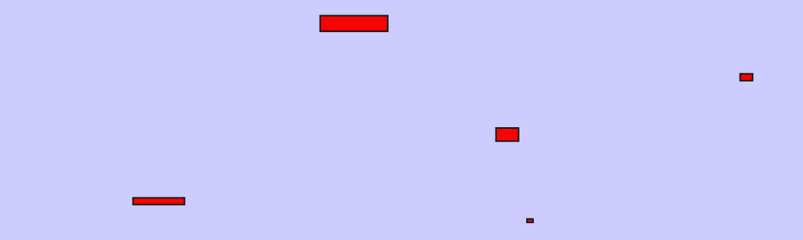
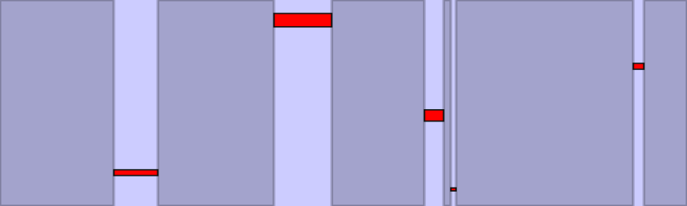
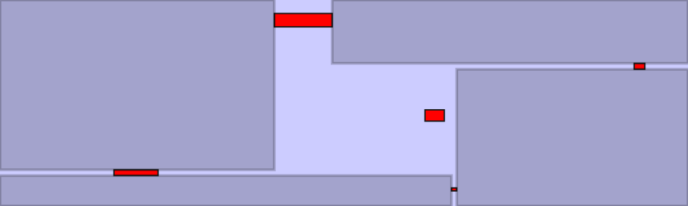
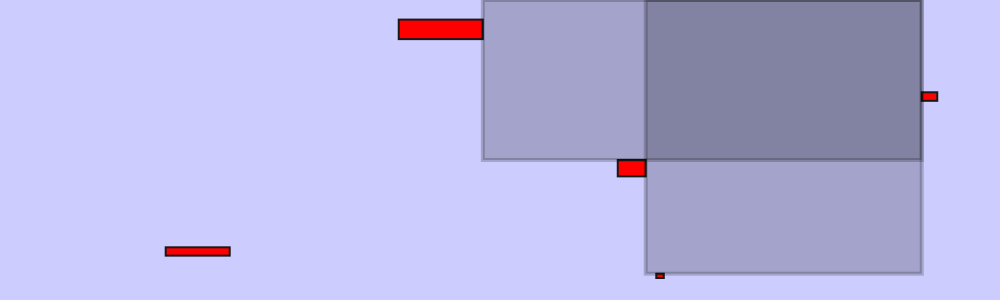
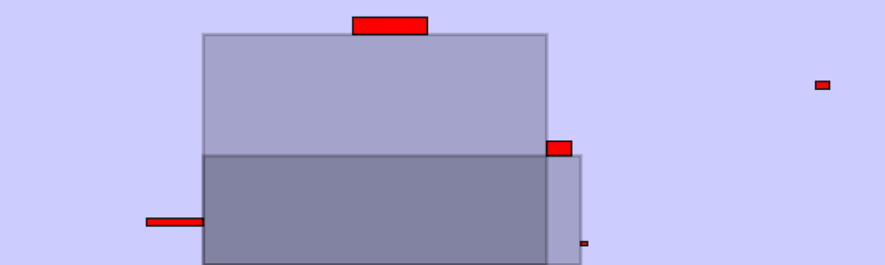

I have worked on two tasks:

1. Generating maximal candidates
2. Optimizing the selection of candidates

**Generating maximal candidates.**
Given a board with defects, the goal of this task is to enumerate all the maximal empty rectangles.
A _maximal empty rectangle_ (MER) is defined as a rectangle containing no defects and not included in any other defect-free rectangle.
Both the board and the defects are represented as rectangles and
the data is randomly generated (but we could also use the annotations from various datasets; _e.g._, Salum, Oulu).

Here is an example of a board (in blue) and defects (in red):

And here are candidate MERs of different types:

- delimited by two opposite sides of the boards (top-bottom and left-right)

- delimited by two adjacent sides of the boards

- delimited by one side of the board (top, left, bottom, right)

The code for this part is available [here](https://bitbucket.org/doneata/optim-cut/src/master/candidates.py).

**Optimizing the selection of candidates.**
The goal is to select the candidate rectangles such _(i)_ the area they cover is maximized and _(ii)_ any two rectangles do not overlap.
To do this we want to optimize the following problem:

$$
\begin{aligned}
\underset{\mathbf{x}}{\text{maximize}} \;\; & \mathbf{w}^\intercal\mathbf{x} \\
\text{subject to} \;\; &  x_i \in \left\{0, 1\right\}, \forall i \\
                       & \mathbf{x}^\intercal \mathbf{A} \mathbf{x} = 0
\end{aligned}
$$

where 

- $\mathbf{x}$ indicates the selection of rectangles, that is, $x_i = 1$ if we select the $i$-th rectangle and $x_i = 0$ otherwise.
- $\mathbf{w}$ contains the area of each of the candidate rectangles.
- $\mathbf{A}$ is a binary matrix with $A_{ij} = 1$ if rectangles $i$ and $j$ overlap and $A_{ij} = 0$ otherwise.

To simplify the optimization problem, I modify it in two ways:
_(i)_ relax the problem to continuous domain;
_(ii)_ move the quadratic constraint into the objective function.
The new optimization problem is:

$$
\begin{aligned}
\underset{\mathbf{x}}{\text{maximize}} \;\; & \mathbf{w}^\intercal\mathbf{x} - \alpha \frac{1}{2} \mathbf{x}^\intercal \mathbf{A} \mathbf{x} \\
\text{subject to} \;\; &  x \ge 0, \forall i\\
                       & \|\mathbf{x}\|_1 = 1
\end{aligned}
$$

To solve this I'm using the [`cvxopt`](https://cvxopt.org) package from Python.
However, currently I'm running into some numerical issues that I need to look into.
The code for this part is available [here](https://bitbucket.org/doneata/optim-cut/src/master/cut_qp.py).

