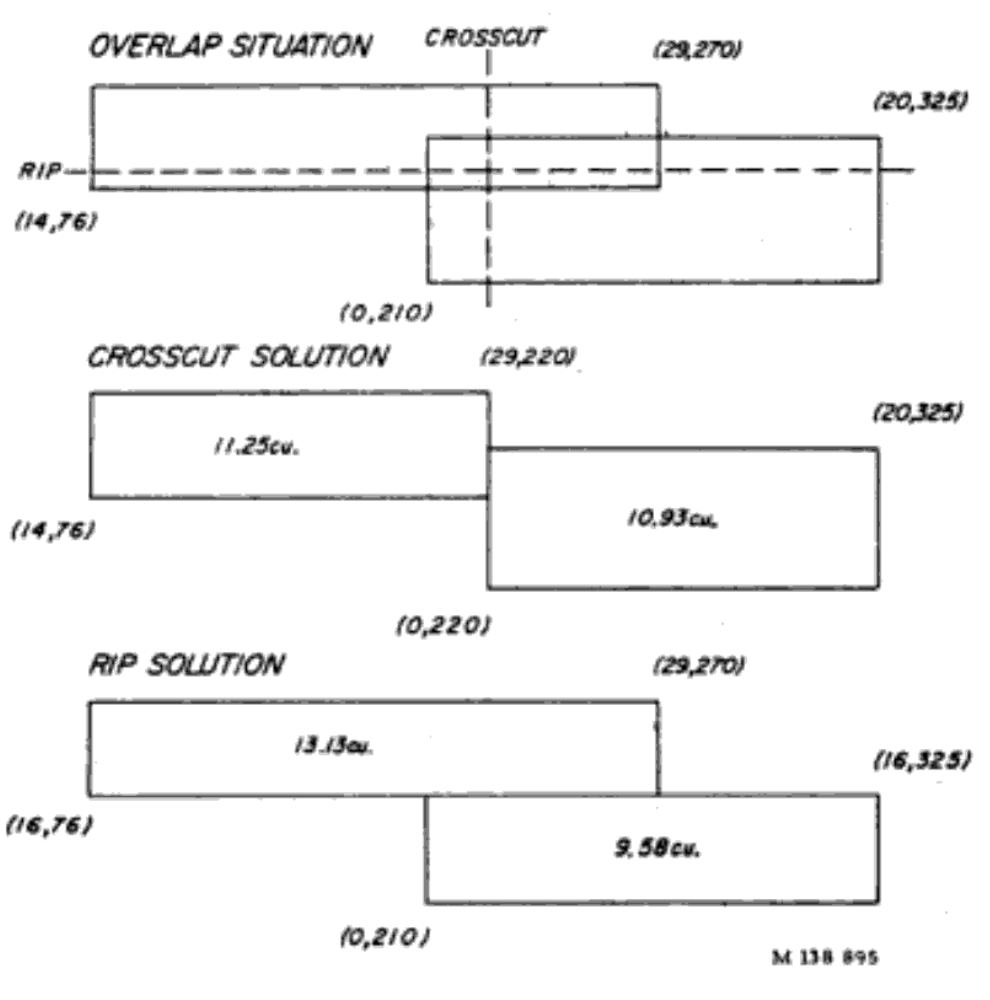

This report present quantitative results for multiple way of generating candidates and selecting those candidates.

Candidates methods:

- _maximal_ – maximal rectangles containing no defects.
- _... + intersection_ – augments _maximal_ with all the intersections and differences between any two overlapping rectangles.
- _... + min. size_ – augments _maximal + intersection_ with differences resolved based on the minimum size of a cut for a particular grade (see image below for an example).



Selection methods:

- _exhaustive_ – iterates through all combinations of candidates, but stops when it finds a solution that yields the required cutting units (consequently, this method returns the optimal grade, but not necessarily the largest area).
- _greedy_ – selects candidates greedily by area. The candidates are fixed from the start. The variant used was `greedy-fixed`.
- _ipqp_ – selects candidates based on the IPQP (or IPFP) algorithm. It uses a penalty on conflicts of 10 and removes the duplicate candidates. The variant used was `ipqp-alpha-10-no-dups`.
- _ipqp-neg-cost_ – uses the IPQP algorithm (with the same settings as before), but adds a further constraint that prevents selecting an existing cut, but composed out of two disjoint cuts.

Dataset:

- 1998 Red Oak dataset, but only the subset of boards which were graded FAS.

Metrics:

- Proportion of faces that were accurately predicted as FAS, according to the NHLA rule book.
- Relative area of the selected cuts to the full board size. We report mean and median values. We use the number of cuts as imposed by the grade (is this right?)

| candidates         | selection     | accuracy (%) | mean rel. area (%) | median rel. area (%) | key |
|--------------------|---------------|--------------|---------------|---------------|-----|
| maximal            | exhaustive    |        92.35 | 90.67 | 92.00 | `exhaustive` |
| ... + intersection | exhaustive    |        96.18 | 90.23 | 91.48 | `exhaustive-extend-inter` |
| ... + min. size    | exhaustive    |        97.55 | 87.66 | 87.50 | `exhaustive-extend-msize` |
| maximal            | greedy        |        88.99 | 90.52 | 92.31 | `greedy-fixed` |
| ... + intersection | greedy        |        89.07 | 90.53 | 92.31 | `greedy-fixed-extend-inter` |
| ... + min. size    | greedy        |        89.37 | 90.61 | 92.31 | `greedy-fixed-extend-msize` |
| maximal            | ipqp          |        89.98 | 90.40 | 92.48 | `ipqp-no-dups-alpha-10` |
| ... + intersection | ipqp          |        88.91 | 90.69 | 92.60 | `ipqp-no-dups-alpha-10-extend-inter` |
| ... + min. size    | ipqp          |        91.28 | 90.99 | 92.47 | `ipqp-no-dups-alpha-10-extend-msize` |
| ... + intersection | ipqp-neg-cost |        90.98 | 91.02 | 92.60 | `ipqp-no-dups-alpha-10-extend-inter-constrained` |

```bash
$ for m in exhaustive exhaustive-extend-inter exhaustive-extend-msize greedy-fixed greedy-fixed-extend-inter greedy-fixed-extend-msize ipqp-no-dups-alpha-10 ipqp-no-dups-alpha-10-extend-inter ipqp-no-dups-alpha-10-extend-msize ipqp-no-dups-alpha-10-extend-inter-constrained; do python scripts/aggregate_results_ro98.py $m; done
```
